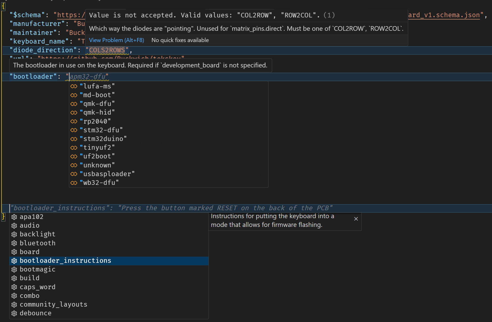

# QMK Types

A TypeScript wrapper for the QMK Firmware type definitions, basicly converting their existing JSON schemas to TS interfaces.

At the moment this module uses a modified version of the QMK JSON schemas. Changes to the official schemas are documented in [schemas/README.md](schemas/README.md). I hope that those changes will soon get integrated into the official repo to have them only in one place (waiting for https://github.com/qmk/qmk_firmware/pull/24594)

## Overview

This repository consists of those parts:
- [schemas](schemas): The schemas used by this module. These are the modified QMK JSON schemas
<!-- - [src](src): This is the actual TypeScript wrapper for the schemas. It only contains the TS interfaces and is publisched at <https://www.npmjs.com/package/@kcf-hub/qmk-types>
- [generator](generator): A script that generates the TS interfaces from the schemas. It also includes a parser that extends the original keyboard.schema.json with descriptions, examples, and default values from the markdown documentation -->

## Usage

### JSON Schemas

If you just want to use the schemas most IDEs and the json schema libs should be compatible with the format published in this repo.

Here's an example how you could use a schema to improve the usability of QMKs `keyboard.json` or `info.json` files:

Just add `"$schema": "https://raw.githubusercontent.com/kcf-hub/qmk-types/refs/heads/main/schemas/keyboard_v1.schema.json"` to your `keyboard.json` or `info.json` file. Similarly you can use `keymap_v1.schema.json` for `keymap.json` files and so on. VS Code will provide the following features as seen in the screenshot:

- value validation
- descriptions for keys
- autocompletion for keys with default values
- autocompletion for values with example/enum data

